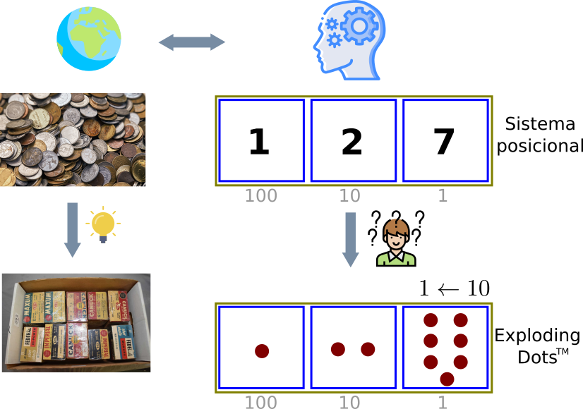
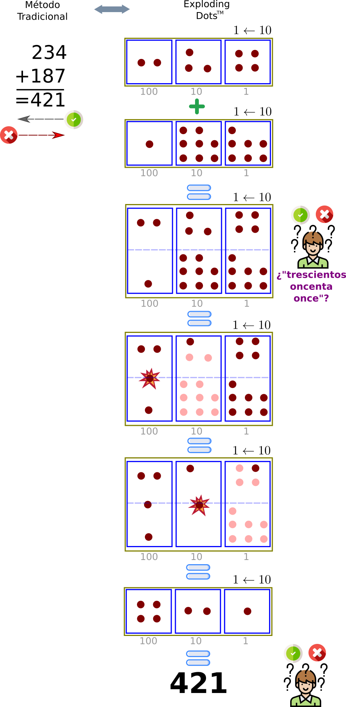
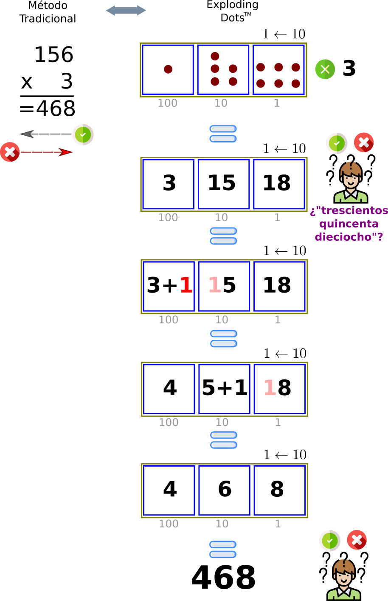
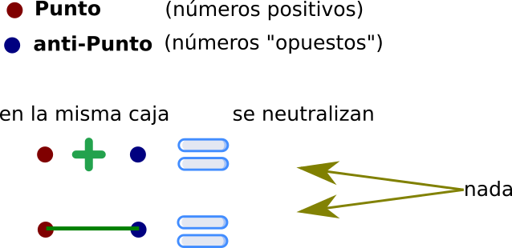
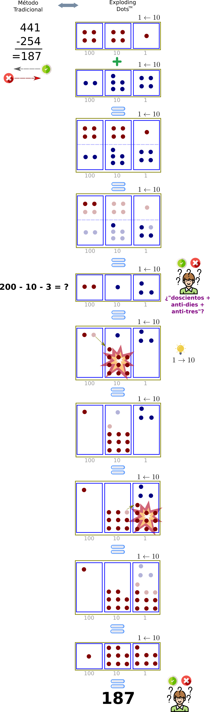
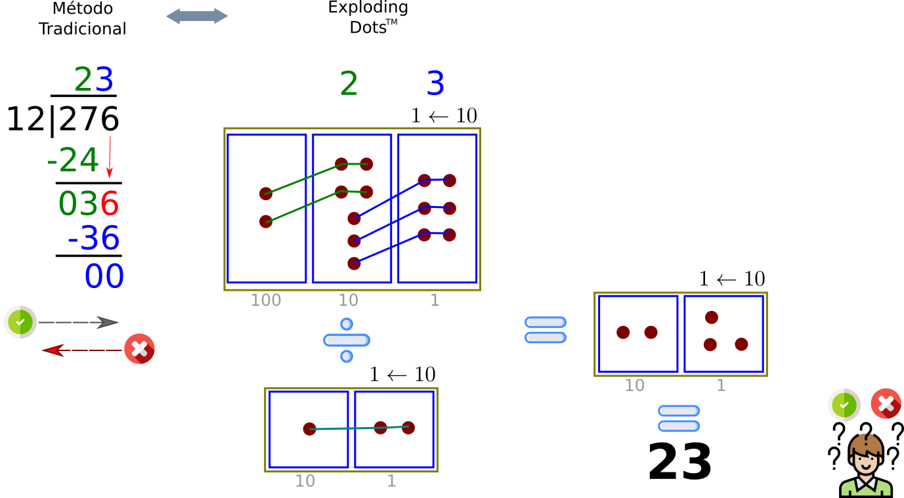
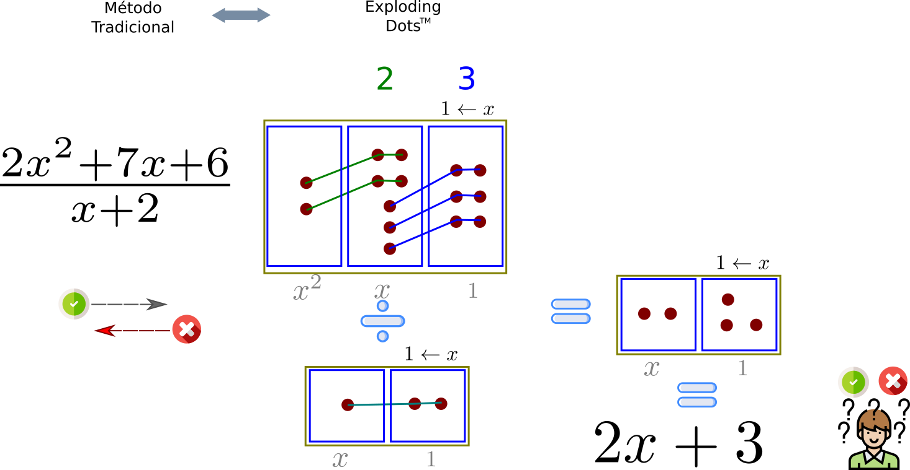

# Iniciar desde 0

En la vida cotidiana parece ser una buena idea organizarnos en varios *niveles* al manejar cantidades grandes: bolsas de bolsas, cajas de cajas ... nos sirven igual, dependiendo de nuestra conveniencia. Claro, buscamos que el problema sea más fácil de manejar.

Se nos olvida nuestra capacidad creativa de **representar** el mundo. Por ejemplo, **el** número cinco usted lo escribiría
- como **'5'** en la actualidad,
- como **'V'** si fuese romano,
- como **'-'** si fuese maya,
- como una **manita abierta**, al igual que mi hija a los tres años,
- ¿cómo lo haría un preso? ... no es retórico, espero una respuesta concreta.

# Mates de primaria otra vez

Requisitos
1. Saber contar enteros positivos
2. Tener una representación posicional para dichos números

## Suma

Recién pudimos leer `el mo-no co-me ba-na-na`, de izquierda a derecha, cuando el profesor de mate nos dice que ahora, con las sumas trabajamos de derecha a izquierda.
	

¿Puede enumerar lo que está en contra de lo **convencionalmente** correcto?

## Multiplicación

## Resta (Aquí nos ponemos serios)

Ok
> La resta no existe. *Eso* a lo que llamamos *resta* es en realidad **la suma del "opuesto"**.
> -*James Tanton*-

Decir algo como 
`5 - 2 ES cinco menos dos`
en vez de 
`5 - 2 ES cinco más dos negativo`
es una *estrategía* educativa/pedagógica a corto plazo que **atenta contra el comiento mismo de aquello que se pretende construir**.

Ahora vamos a *restar* diferente, pero tendremos nuevos requisitos:
1. Poner nombre al dibujo de los números positivos
2. Dibujar y nombrar a los números "opuestos"
Como muestra de creatividad, a continuación presento una solución muy simpática que me han propuesto

	

Si ya sé, ... "NO GRACIAS, se supone que sería más fácil, es muy extenso". La metodología de la derecha en los ejemplos anteriores empieza a ser evidentemente simple cuando vemos la división.

## División (para cerrar)

En el ejemplo anteior, podemos leer la caja más grande a la derecha como
$
276
 = 120 + 120 + 12 + 12 + 12 
= 10 \times 12 + 10 \times 12 + 12 + 12 + 12
$

# Llegamos a la secundaria, otra vez

Aqui nos encontramos con la famosa $x$ que tanto les gustaba a los maestros (muchos la extraviaron y nos piden encontrarla).  No se preocupe, vamos a pasar directo a la división con $x$'s.

## División en base $x$.

En el ejemplo anteior, podemos leer la caja más grande a la derecha como
$
2x^2 + 7x + 6
= (x^2+2x) + (x^2+2x) + (x+2) + (x+2) + (x+2)
= x(x+2) + x(x+2) + (x+2) + (x+2) + (x+2)
$

# Resumen

Hicimos todo lo anterior gracias a dos bloques de construcción matemáticos, los axiomas

* ``x + 0 = 0``,
* ``x − x = 0``.

Ellos indican verdades tan simples que los pasamos desapercibidos. Junto con los demás axiomas de campo y las leyes de potencias, estos axiomas forman el núcleo del Álgebra, que es la base de las matemáticas que cualquier persona en áreas no STEM requiere en su vida diaria y profesional.